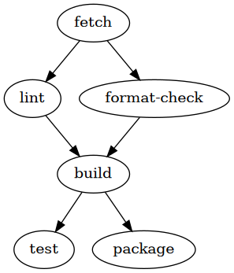

<div align="center">

# setup-prod

Downloads and installs [Sysprod Prod](https://github.com/sysprod/prod) CLI in your GitHub Actions workflow

[Usage](#usage)&nbsp;&nbsp;&nbsp;|&nbsp;&nbsp;&nbsp;[Inputs](#inputs)&nbsp;&nbsp;&nbsp;|&nbsp;&nbsp;&nbsp;[Outputs](#ouputs)&nbsp;&nbsp;&nbsp;|&nbsp;&nbsp;&nbsp;[Example](#example)&nbsp;&nbsp;&nbsp;|&nbsp;&nbsp;&nbsp;[Develop](#develop)&nbsp;&nbsp;&nbsp;
|&nbsp;&nbsp;&nbsp;[Contributing](#contributing)&nbsp;&nbsp;&nbsp;|&nbsp;&nbsp;&nbsp;[License](#license)&nbsp;&nbsp;&nbsp;

[](https://github.com/sysprod/setup-prod/actions)
</div>

## Usage

This action can be run on ubuntu-latest, windows-latest, and macos-latest GitHub Actions runners.

The default configuration installs the latest version of Prod CLI.
```yaml
steps:
- uses: sysprod/setup-prod@v1
- run: prod --no-cache
```

A specific version can be installed, corresponding to the version of a [Prod release](https://github.com/sysprod/prod/releases).
```yaml
steps:
- uses: sysprod/setup-prod@v1
  with:
    version: v0.2
- run: prod --no-cache
```

To avoid Github rate limit exceptions, the `GITHUB_TOKEN` can be set.
With your builtin Github action secret:
```yaml
steps:
- uses: sysprod/setup-prod@v1
  with:
    GITHUB_TOKEN: ${{ secrets.GITHUB_TOKEN }}
- run: prod --no-cache
```

With a personal access token that has been set as repository's secret (e.g. `PERSONAL_ACCESS_TOKEN`):
```yaml
steps:
- uses: sysprod/setup-prod@v1
  with:
    GITHUB_TOKEN: ${{ secrets.PERSONAL_ACCESS_TOKEN }}
- run: prod --no-cache
```

## Inputs

The action supports the following inputs:

- `version`: (optional, default: latest) Version of Prod to use
- `GITHUB_TOKEN`: (optional, default: unauthenticated request) Github token or personal access token to download Prod from the Github package registry allowing higher Github API rate limit
- `base_url`: (optional) Download from a different base url

Set the Action specification [action.yml](action.yml) for more information.

## Outputs

This action has specific output.

## Example

See [ci.yml](.github/workflows/ci.yml).

## Develop
### Source
[main.ts](src/main.ts)

### Run CI/CD locally
1. Download [Prod](https://github.com/sysprod/prod/releases)
2. Run: `prod --no-cache`



Or run individually steps in `cicd.d/`, e.g. `cicd.d/test`

## Contributing
Pull-requests, feature requests and issues are welcome.

## License
[Mozilla Public License Version 2.0](LICENSE)
